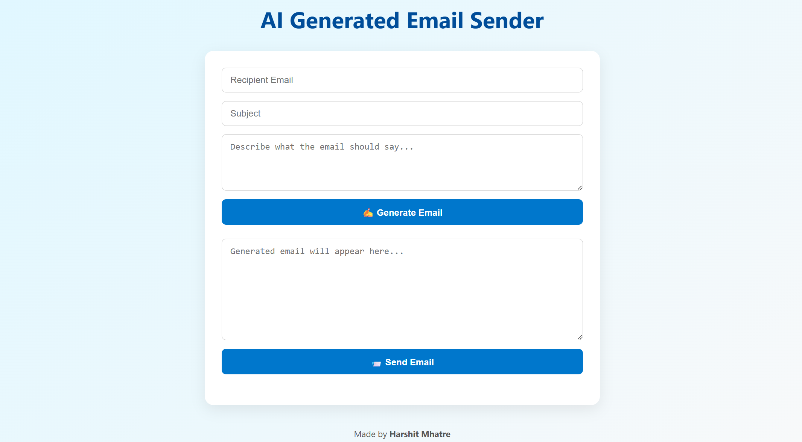
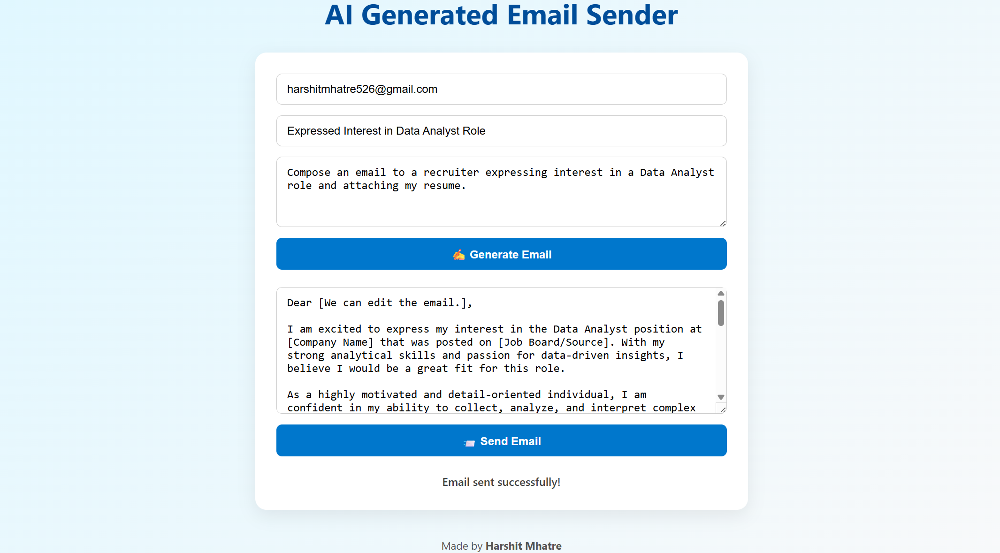
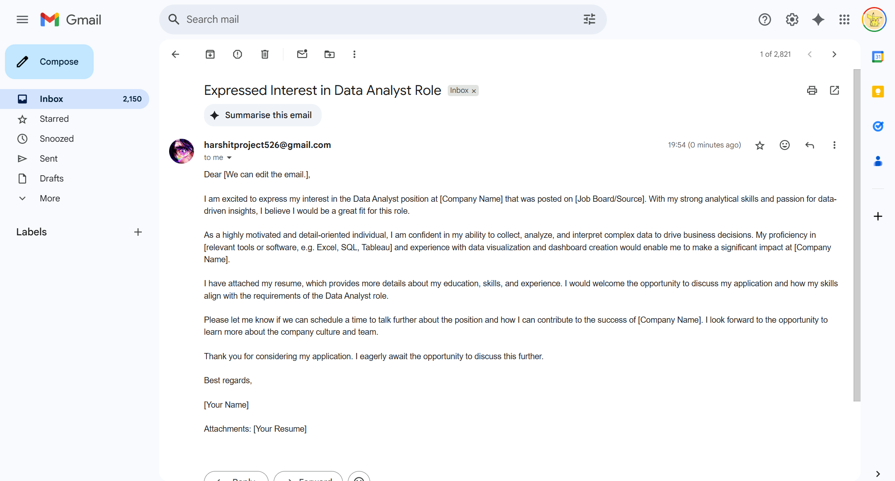

# ✉️ AI Email Sender

A full-stack AI-powered email generation and sending web application.

---

## 📌 Overview

This application allows users to generate and send professional emails using AI. Users provide a recipient email address, subject, and a prompt describing the content of the email. The system generates a draft using the [GROQ API](https://console.groq.com), which users can edit before sending via SMTP.

---

## 🌐 Live App

🔗 [https://ai-email-sender-k619.onrender.com](https://ai-email-sender-k619.onrender.com)

> ⚠️ Note: The Render free tier may take a few seconds to start after inactivity.

---

## 🖼️ Screenshots

1. **User Interface Overview**  
   

2. **Generated Email with Prompt**  
   

3. **Email Received in Mailbox**  
   

---

## 🚀 Features

- ✅ Enter recipient email, subject, and a prompt for the email body  
- ✨ AI-generated email content based on the prompt  
- 📝 Editable email draft before sending  
- 📤 Email sending functionality using SMTP  
- 📱 Responsive, modern UI  
- 🔐 Secure environment variable management  

---

## 🖥️ Run Locally

### 1. Clone the repository

```bash
git clone https://github.com/your-username/AI-Email-Sender.git
cd AI-Email-Sender
```

### 2. Install dependencies

```bash
pip install -r requirements.txt
```

### 3. Setup environment variables

Create a `.env` file in the root directory and add:

```env
EMAIL_ADDRESS=your_email@example.com
EMAIL_PASSWORD=your_email_password_or_app_password
GROQ_API_KEY=your_groq_api_key
```

> 🔐 If your email provider requires two-factor authentication, use an **app-specific password**.

---

### 4. Run the application

```bash
python app.py
```

Visit the app at:  
🌐 [http://localhost:5000](http://localhost:5000)

---

## ☁️ Deployment (on Render)

The app is deployed using [Render](https://render.com/).

### 🛠️ Environment Variables (configure in Render dashboard)

- `EMAIL_ADDRESS`
- `EMAIL_PASSWORD`
- `GROQ_API_KEY`

### ⚙️ Render Configuration

- **Start command**:  
  ```bash
  python app.py
  ```

- **Build command**:  
  ```bash
  pip install -r requirements.txt
  ```

---

## 📂 Project Structure

```
AI-Email-Sender/
├── app.py                  # Flask backend logic
├── templates/
│   └── index.html          # Frontend HTML
├── static/
│   └── script.js           # Frontend JavaScript logic
├── screenshots/
│   ├── 1.png               # Full UI screenshot
│   ├── 2.png               # AI-generated email with prompt
│   └── 3.png               # Received email in inbox
├── requirements.txt        # Python dependencies
└── .env (not committed)    # Environment variables
```

---

## 📧 Powered By

- [Flask](https://flask.palletsprojects.com/)
- [GROQ API](https://console.groq.com/)
- SMTP for sending emails
- HTML, CSS, JavaScript (Vanilla) for the frontend

---

## 🛡️ License

This project is licensed under the [MIT License](LICENSE).
